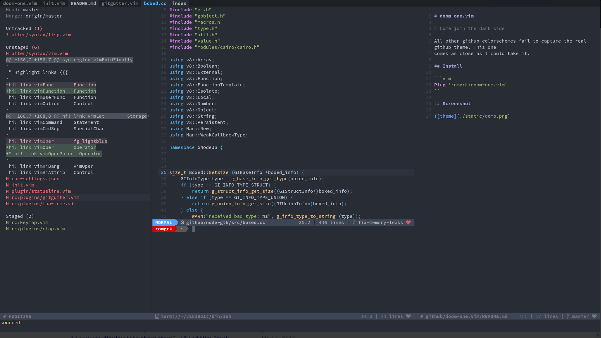

# doom-one-v1

> Come join the dark side

This colorscheme is ported from [romgrk/doom-one.vim](https://github.com/hlissner/emacs-doom-themes/blob/master/themes/doom-one-theme.el).

## Install

```vim
Plug 'darwin808/doom-one-v1'
```

## Screenshot



## Options

Neovim terminal coloring can be enabled as by adding the following above the plugin includes:

```vim
let g:doom_one_terminal_colors = v:true
```
